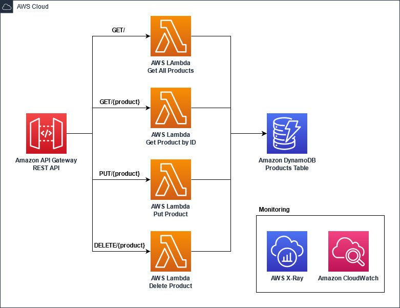
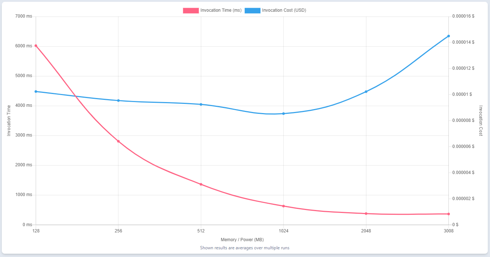

## Lambda demo with .NET



This is a simple serverless application built in using .NET 6. It is a .NET implementation of the [Java Serverless Samples](https://github.com/aws-samples/serverless-java-frameworks-samples) that can be used for benchmarking.

It consists of an [Amazon API Gateway](https://aws.amazon.com/api-gateway/) backed by four [AWS Lambda](https://aws.amazon.com/lambda/)
functions and an [Amazon DynamoDB](https://aws.amazon.com/dynamodb/) table for storage.

It includes a .NET Core 3.1 and .NET 6 Lambda implementation using a project per function as well as using the new .NET 6 minimal API hosting model.

## Requirements

- [AWS CLI](https://aws.amazon.com/cli/)
- [AWS SAM](https://aws.amazon.com/serverless/sam/)
- .NET 6 OR .NET Core 3.1
- [Artillery](https://www.artillery.io/) for load-testing the application
- Docker

## Software

There are four implementations included in the repository, covering a variety of Lambda runtimes and features. All of the implementations use 1024MB of memory with Graviton2 (ARM64) as default. Tests have been executed against x86_64 architectures for comparison.

### .NET Core 3.1
There is a separate project for each of the four Lambda functions, as well as a shared library that contains the data access implementations. It uses the hexagonal architecture pattern to decouple the entry points, from the main domain logic
and the storage logic. It uses .NET Core 3.1 to allow a direct comparison to .NET 6 benchmarks.

### .NET 6
There is a separate project for each of the four Lambda functions, as well as a shared library that contains the data access implementations. It uses the hexagonal architecture pattern to decouple the entry points, from the main domain logic
and the storage logic. The functions are build using the standard pattern of having a class and a Handler method. This is the same as required when using .NET Core 3.1.

This is the simples route to upgrade a .NET Core 3.1 function to use .NET 6 as it only requires upgrading the function runtime, project target framework and any dependencies as per the final section of [this link](https://aws.amazon.com/blogs/compute/introducing-the-net-6-runtime-for-aws-lambda/).

### .NET 6 Top Level Statements
There is a separate project for each of the four Lambda functions, as well as a shared library that contains the data access implementations. It uses the hexagonal architecture pattern to decouple the entry points, from the main domain logic
and the storage logic.

The Lambda implementation uses the new features detailed in [this link](https://aws.amazon.com/blogs/compute/introducing-the-net-6-runtime-for-aws-lambda/) including
- Top Level Statements
- Source generation
- Executable assemblies

### .NET 6 Native
There is a separate project for each of the four Lambda functions, as well as a shared library that contains the data access implementations. The code is compiled nativly for either Linux-x86_64 or Linux-ARM64 and then deployed manually to Lambda as a zip file. The SAM deploy can still be used to stand up the API Gateway endpoints and DynamoDb table, but won't be able to deploy Native .NET Lambda functions yet. Packages need to be published from Linux, since cross-OS native compilation is not supported yet. 

Details for compiling .NET 6 Native can be found [here](https://github.com/dotnet/runtimelab/blob/feature/NativeAOT/docs/using-nativeaot/compiling.md)

### Minimal API
There is a single project named ApiBootstrap that contains all of the startup code and API endpoint mapping. The SAM template still deploys a separate function per API endpoint to negate concurrency issues.

It uses the new minimal API hosting model as detailed [here](https://aws.amazon.com/blogs/compute/introducing-the-net-6-runtime-for-aws-lambda/). 

## Deployment and Testing

To deploy the architecture into your AWS account navigate into the respective folder under the src folder and run 'sam deploy'. For example for .NET 6:

``` bash
cd src/.NET6
sam build
sam deploy
```

## Summary
Below is the cold start and warm start latencies observed. Please refer to the load test folder to see the specifics of the test that were executed.

All latencies listed below are in milliseconds.

[Artillery](https://www.artillery.io/) is used to make **100 requests / second for 10 minutes to our API endpoints**.

[AWS Lambda Power Tuning](https://github.com/alexcasalboni/aws-lambda-power-tuning) is used to optimize the cost/performance. 1024MB of function memory provided the optimal balance between cost and performance.



### Results

The below CloudWatch Log Insights query was used to generate the results:

```
filter @type="REPORT"
| fields greatest(@initDuration, 0) + @duration as duration, ispresent(@initDuration) as coldstart
| stats count(*) as count, pct(duration, 50) as p50, pct(duration, 90) as p90, pct(duration, 99) as p99, max(duration) as max by coldstart
```

<table class="table-bordered">
        <tr>
            <th colspan="1" style="horizontal-align : middle;text-align:center;"></th>
            <th colspan="4" style="horizontal-align : middle;text-align:center;">Cold Start (ms)</th>
            <th colspan="4" style="horizontal-align : middle;text-align:center;">Warm Start (ms)</th>           
        </tr>
        <tr>
            <th></th>
            <th scope="col">p50</th>
            <th scope="col">p90</th>
            <th scope="col">p99</th>
            <th scope="col">max</th>
            <th scope="col">p50</th>
            <th scope="col">p90</th>
            <th scope="col">p99</th>
            <th scope="col">max</th>
        </tr>
        <tr>
            <th>.NET Core 3.1 (arm64)</th>
            <td>1122.70</td>
            <td>1170.83</td>
            <td>1225.92</td>
            <td>1326.32</td>
            <td><b style="color: green">5.55</b></td>
            <td><b style="color: green">8.74</b></td>
            <td><b style="color: green">19.85</b></td>
            <td>256.55</td>
        </tr>
        <tr>
            <th>.NET Core 3.1 (x86_64)</th>
            <td>1004.80</td>
            <td>1135.81</td>
            <td>1422.78</td>
            <td>1786.78</td>
            <td><b style="color: green">6.11</b></td>
            <td><b style="color: green">10.82</b></td>
            <td><b style="color: green">29.40</b></td>
            <td>247.32</td>
        </tr>
        <tr>
            <th>.NET 6 (arm64)</th>
            <td>873.59</td>
            <td>909.23</td>
            <td>944.42</td>
            <td>945.25</td>
            <td><b style="color: green">5.50</b></td>
            <td><b style="color: green">9.24</b></td>
            <td><b style="color: green">19.53</b></td>
            <td>421.72</td>
        </tr>
        <tr>
            <th>.NET 6 (x86_64)</th>
            <td>778.74</td>
            <td>966.39</td>
            <td>1470.50</td>
            <td>1659.51</td>
            <td><b style="color: green">6.41</b></td>
            <td><b style="color: green">11.90</b></td>
            <td><b style="color: green">31.33</b></td>
            <td>255.98</td>
        </tr>
        <tr>
            <th>.NET 6 Top Level Statements</th>
            <td>916.53</td>
            <td>955.82</td>
            <td>985.90</td>
            <td>1021.40</td>
            <td><b style="color: green">5.73</b></td>
            <td><b style="color: green">9.38</b></td>
            <td><b style="color: green">20.65</b></td>
            <td>417.23</td>
        </tr>        
        <tr>
            <th>Minimal API</th>
            <td>1149.95</td>
            <td>1194.47</td>
            <td>1239.47</td>
            <td>1315.07</td>
            <td><b style="color: green">6.10</b></td>
            <td><b style="color: green">10.00</b></td>
            <td><b style="color: green">22.91</b></td>
            <td>1315.07</td>
        </tr>
        <tr>
            <th>.NET 6 Native (arm64)</th>
            <td>448.97</td>
            <td>467.75</td>
            <td>493.20</td>
            <td>516.6</td>
            <td><b style="color: green">6.30</b></td>
            <td><b style="color: green">10.49</b></td>
            <td><b style="color: green">21.50</b></td>
            <td>461.35</td>
        </tr>
        <tr>
            <th>.NET 6 Native (x86_64)</th>
            <td>466.81</td>
            <td>542.86</td>
            <td>700.45</td>
            <td>730.51</td>
            <td><b style="color: green">6.21</b></td>
            <td><b style="color: green">11.34</b></td>
            <td><b style="color: green">24.69</b></td>
            <td>371.16</td>
        </tr>
</table>

## Security

See [CONTRIBUTING](CONTRIBUTING.md#security-issue-notifications) for more information.

## License

This library is licensed under the MIT-0 License. See the LICENSE file.
